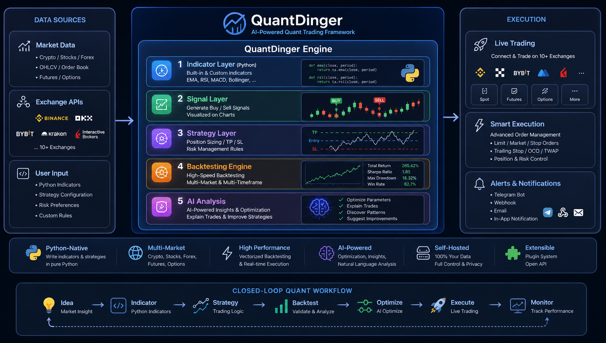
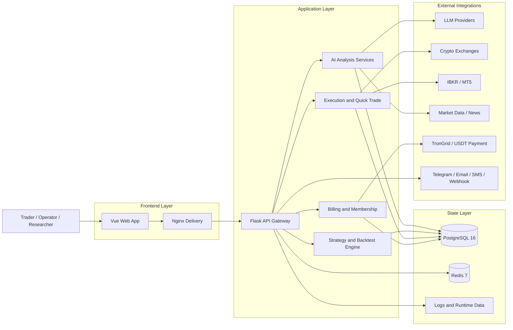

<div align="center">
  <a href="https://github.com/brokermr810/QuantDinger">
    
  </a>

  <h1>QuantDinger</h1>
  <h3>Your Private AI Quant Operating System</h3>
  <p><strong>One deployable stack for charting, AI market research, Python indicators &amp; strategies, backtests, and live execution—on your own servers and your own keys.</strong></p>
  <p><em>Self-hosted quantitative platform: from idea and AI-assisted coding to paper-style workflows and exchange-connected live trading, with optional multi-user and billing primitives for operators.</em></p>

  <div align="center" style="max-width: 680px; margin: 1.25rem auto 0; padding: 20px 22px 22px; border: 1px solid #d1d9e0; border-radius: 16px;">
    <p style="margin: 0 0 14px; line-height: 1.65;">
      <a href="README.md"><strong>English</strong></a>
      <span style="color: #afb8c1;"> · </span>
      <a href="docs/README_CN.md"><strong>简体中文</strong></a>
    </p>
    <p style="margin: 0 0 18px; padding-bottom: 16px; border-bottom: 1px solid #eaeef2; line-height: 2;">
      <a href="https://ai.quantdinger.com"><strong>SaaS</strong></a>
      <span style="color: #d8dee4;"> &nbsp;·&nbsp; </span>
      <a href="https://www.youtube.com/watch?v=tNAZ9uMiUUw"><strong>Video Demo</strong></a>
      <span style="color: #d8dee4;"> &nbsp;·&nbsp; </span>
      <a href="https://www.quantdinger.com"><strong>Website</strong></a>
      <span style="color: #d8dee4;"> &nbsp;·&nbsp; </span>
      <a href="https://aws.amazon.com/marketplace/pp/prodview-naanrb7d2mbc6"><strong>AWS Marketplace</strong></a>
    </p>
    <p style="margin: 0; line-height: 2;">
      <a href="https://t.me/quantdinger"></a>
      &nbsp;
      <a href="https://discord.com/invite/tyx5B6TChr"></a>
      &nbsp;
      <a href="https://youtube.com/@quantdinger"></a>
      &nbsp;
      <a href="https://x.com/QuantDinger_EN"></a>
    </p>
  </div>

  <p style="margin-top: 1.45rem; margin-bottom: 10px;">
    <a href="LICENSE"></a>
    
    
    
    
    
  </p>
  <p style="margin: 10px 0 12px;">
    <a href="https://aws.amazon.com/marketplace/pp/prodview-naanrb7d2mbc6"></a>
  </p>
  <p style="margin: 12px 0 10px;">
    <a href="https://oosmetrics.com/repo/brokermr810/QuantDinger"></a>
  </p>
  <p style="margin-top: 14px;">
    <a href="https://www.producthunt.com/products/quantdinger/launches/quantdinger?embed=true&amp;utm_source=badge-featured&amp;utm_medium=badge&amp;utm_campaign=badge-quantdinger" target="_blank" rel="noopener noreferrer"></a>
  </p>
</div>

---

> QuantDinger is a **self-hosted, local-first** quantitative platform: **AI-assisted research**, **Python-native strategies**, **backtesting**, and **live trading** (crypto, IBKR stocks, MT5 forex) in one product—not a loose collection of scripts and SaaS tabs.

<div align="center">
  
  <p><sub><em>End-to-end architecture: market data feeds the five-layer engine and exits to live execution, closing the quant loop from idea to monitoring.</em></sub></p>
</div>

## Try in 2 minutes

**Prerequisites:** [Docker](https://docs.docker.com/get-docker/) with Compose (Docker Desktop on Windows/macOS, or Docker Engine + Compose plugin on Linux), and **Git**. Node.js is **not** required (prebuilt UI is in `frontend/dist`).

### macOS / Linux (Bash)

One line (or run the same steps separately):

```bash
git clone https://github.com/brokermr810/QuantDinger.git && cd QuantDinger && cp backend_api_python/env.example backend_api_python/.env && chmod +x scripts/generate-secret-key.sh && ./scripts/generate-secret-key.sh && docker-compose up -d --build
```

If `./scripts/generate-secret-key.sh` fails with “Permission denied”, run `chmod +x scripts/generate-secret-key.sh` and retry. If `docker-compose` is not found, try `docker compose` (Compose V2).

### Windows (PowerShell)

Use **PowerShell** (not CMD) in a folder where you want the project. **Docker Desktop** must be running (WSL2 backend recommended).

```powershell
git clone https://github.com/brokermr810/QuantDinger.git
Set-Location QuantDinger
Copy-Item backend_api_python\env.example -Destination backend_api_python\.env
$key = & python -c "import secrets; print(secrets.token_hex(32))" 2>$null
if (-not $key) { $key = & py -c "import secrets; print(secrets.token_hex(32))" 2>$null }
if (-not $key) { $key = & python3 -c "import secrets; print(secrets.token_hex(32))" 2>$null }
if (-not $key) { Write-Error "Install Python 3 from python.org (tick 'Add to PATH') or use Git Bash with the macOS/Linux block above." }
(Get-Content backend_api_python\.env) -replace '^SECRET_KEY=.*$', "SECRET_KEY=$key" | Set-Content backend_api_python\.env -Encoding utf8
docker-compose up -d --build
```

If `docker-compose` is not recognized, use **`docker compose`** (space, no hyphen). If Git is missing, install [Git for Windows](https://git-scm.com/download/win).

### Windows alternative: Git Bash

If you installed **Git for Windows**, open **Git Bash** and you can use the **macOS / Linux** one-liner above (Bash + `chmod` + `./scripts/generate-secret-key.sh`).

---

Then open **`http://localhost:8888`**, sign in with **`quantdinger` / `123456`**, and **change the default admin password** before any real use. For prerequisites, configuration details, first-run checks, and troubleshooting, continue to **[Installation & first-time setup](#installation--first-time-setup-docker-compose)** below.

## What is QuantDinger?

QuantDinger is built for people who want **one controlled environment** instead of stitching together chart apps, Jupyter, bots, and dashboards:

- **Research**: AI-driven analysis, watchlists, and multi-market context (crypto, equities, forex, optional prediction-market workflows).
- **Build**: Indicator-style (`IndicatorStrategy`) and script-style (`ScriptStrategy`) Python; optional natural-language → code to bootstrap.
- **Validate**: Server-side backtests, metrics, and equity curves tied to the same strategy model you iterate in the UI.
- **Operate**: Live strategies, quick trade, notifications, and execution adapters—credentials stay in **your** Postgres-backed vault and `.env`.
- **Grow (optional)**: Multi-user patterns, credits, memberships, and USDT billing hooks for teams that ship a product, not only a personal bot.

If you are looking for an **open-source quant stack**, **self-hosted AI trading workspace**, or **NL → Python strategy workflow** with a real operator surface, this repository is the integration point.

## Why QuantDinger? AI-Powered Quantitative Trading and Backtesting

- **Self-hosted by design**: your credentials, strategy code, market workflows, and operational data stay under your control.
- **Research to execution in one product**: AI analysis, charting, strategy logic, backtests, quick trade, and live operations are connected.
- **Python-native and AI-assisted**: write indicators and strategies directly in Python, or use AI to accelerate drafting and iteration.
- **Built for operators, not just demos**: Docker Compose, PostgreSQL, Redis, Nginx, health checks, worker toggles, and environment-based configuration.
- **Commercialization-ready**: memberships, credits, admin management, and USDT payment flows are already part of the stack.

## The Core Promise

QuantDinger gives you something most trading tools do not:

- **one stack instead of five** for research, strategy code, backtests, execution, alerts, and operations
- **AI that sits inside the workflow**, not beside it
- **Python flexibility without losing product UX**
- **private deployment without giving up growth features**

## QuantDinger vs Patchwork Setups

| Typical Setup | QuantDinger |
|---------------|-------------|
| AI chat tool disconnected from real strategy workflows | AI analysis, AI code generation, backtest feedback, and execution workflows live in one product |
| Separate charting app, Python scripts, bot runner, and notification stack | One deployable platform for charting, strategy logic, runtime services, and alerts |
| Hosted SaaS with limited control over credentials and alpha | Self-hosted architecture with your own infra, keys, and operational data |
| Research tools with no operator layer | Multi-user roles, billing, credits, admin controls, and deployment-ready configuration |

## Who It Is For

- **Traders and quants** who want AI-assisted market research without giving up control of infrastructure and data.
- **Python strategy developers** who want charting, backtests, and live execution in one environment.
- **Small teams and studios** building internal trading tools or private research platforms.
- **Operators and founders** who need a deployable product with user management, billing, and admin controls.

## Use Cases

- **AI-assisted market research** for crypto, stocks, forex, and cross-market workflows
- **Python-native strategy development** for quantitative trading and algorithmic trading teams
- **Backtesting and iteration** for signal strategies, saved strategies, and execution assumptions
- **Private trading infrastructure** for teams that want self-hosted deployment and privacy-first operations
- **Commercial trading products** that need users, billing, credits, and admin controls

## Visual Tour

<table align="center" width="100%">
  <tr>
    <td colspan="2" align="center">
      <a href="https://www.youtube.com/watch?v=wHIvvv6fmHA">
        
      </a>
      <br/>
      <sub>
        <a href="https://www.youtube.com/watch?v=wHIvvv6fmHA">
          <strong>▶ Watch Product Demo on YouTube</strong>
        </a>
      </sub>
      <br/>
      <sub>Click the preview card above to open the full video walkthrough.</sub>
    </td>
  </tr>
  <tr>
    <td width="50%" align="center"><br/><sub>Indicator IDE, charting, backtest, and quick trade</sub></td>
    <td width="50%" align="center"><br/><sub>AI asset analysis and opportunity radar</sub></td>
  </tr>
  <tr>
    <td align="center"><br/><sub>Trading bot workspace and automation templates</sub></td>
    <td align="center"><br/><sub>Strategy live operations, performance, and monitoring</sub></td>
  </tr>
</table>

## What You Can Do With QuantDinger

### AI Research and Decision Support

- Run fast AI-driven market analysis across price action, kline structure, macro/news context, and selected external inputs.
- Store analysis history and memory for repeatable review and future calibration.
- Configure multiple LLM providers such as OpenRouter, OpenAI, Gemini, DeepSeek, and more.
- Optionally enable ensemble and calibration-style flows for more robust AI outputs.

### Indicator and Strategy Development

- Build `IndicatorStrategy` workflows for dataframe-based signals, chart overlays, and signal backtests.
- Build `ScriptStrategy` workflows for stateful runtime logic, explicit order control, and live execution alignment.
- Generate indicator or strategy code from natural language and refine it in Python.
- Visualize indicators, buy/sell signals, and strategy output directly on professional chart interfaces.

### Backtesting and Iteration

- Run historical backtests with stored trades, metrics, and equity curves.
- Backtest both indicator-driven logic and saved strategy records.
- Persist strategy snapshots and review historical runs for reproducibility.
- Use AI-assisted post-backtest analysis to improve parameters and execution assumptions.

### Live Trading and Operations

- Connect crypto exchanges through a unified execution layer.
- Use quick-trade flows to go from analysis to action faster.
- Monitor open positions, review trade history, and close positions from the platform.
- Run automated or semi-automated strategy workflows with runtime services and workers.

### Multi-Market Coverage

- Crypto spot and derivatives
- US stocks through IBKR
- Forex through MT5
- Prediction market research through Polymarket analysis workflows

### Multi-User, Alerts, and Billing

- PostgreSQL-backed multi-user system with role-based access patterns.
- OAuth support for Google and GitHub.
- Notification channels including Telegram, Email, SMS, Discord, and Webhooks.
- Membership plans, credits, USDT TRC20 payments, and admin-side billing controls.

## AI Capabilities

QuantDinger is not just "LLM chat added to a trading app". The current AI layer is integrated into the actual research and strategy workflow.

### Fast Analysis

- Structured AI market analysis for quick decision support
- Lower-latency workflow than older multi-hop orchestration
- Useful for daily market review, trade planning, and opportunity screening

### AI Strategy and Indicator Generation

- Natural language to Python indicator code
- Natural language to strategy code and config scaffolding
- Better fit for traders who know the idea they want, but want to accelerate implementation

### Analysis Memory and Review

- Historical analysis storage
- Better repeatability and comparison over time
- A foundation for future calibration and reflection loops

### Ensemble, Calibration, and Reflection

- Optional multi-model ensemble configuration
- Confidence calibration and reflection-style worker support
- Better operational path for teams that want more stable AI-assisted workflows

### AI-Assisted Backtest Feedback

- Backtest outputs can feed into AI-generated suggestions
- Useful for parameter tuning, risk adjustments, and faster iteration

### Polymarket and Cross-Market Research

- Analyze prediction markets as a research workflow
- Compare AI view versus market-implied probabilities
- Surface divergence and opportunity scoring

## Why It Is Different

Most trading stacks give you one or two of these pieces. QuantDinger aims to give you the full operating system:

1. **Self-hosted infrastructure**
2. **AI research workflows**
3. **Python strategy development**
4. **Backtesting**
5. **Live execution**
6. **Portfolio and notification operations**
7. **Commercialization primitives**

That combination is the core difference.

## Why It Converts Better Than a Typical Trading Tool

- **For traders**: it shortens the path from idea to execution.
- **For quants**: it keeps Python and strategy control front and center.
- **For operators**: it adds the parts most open-source trading projects skip, including users, billing, roles, and deployability.
- **For AI-first workflows**: it turns analysis into something actionable, reviewable, and eventually automatable.

## How It Works

At a practical level, QuantDinger runs as a self-hosted application stack:

- a prebuilt Vue frontend served by Nginx
- a Flask API backend with Python services
- PostgreSQL for state, users, strategies, and history
- Redis for worker support and runtime coordination
- exchange, broker, AI, payment, and notification integrations through configurable adapters

### Architecture Summary

| Layer | Technology |
|-------|-----------|
| Frontend | Prebuilt Vue application served by Nginx |
| Backend | Flask API, Python services, strategy runtime |
| Storage | PostgreSQL 16 |
| Cache / worker support | Redis 7 |
| Trading layer | Exchange adapters, IBKR, MT5 |
| AI layer | LLM provider integration, memory, calibration, optional workers |
| Billing | Membership, credits, USDT TRC20 payment flow |
| Deployment | Docker Compose with health checks |

### Execution Model

- Market data is pulled through a pluggable data layer.
- Backtests run on the server-side strategy engine, including strategy snapshot handling.
- Live strategies run through runtime services that generate order intent.
- Pending orders are then dispatched through exchange-specific execution adapters.
- Crypto live execution is intentionally separated from market-data collection concerns.

### System Diagram



## Installation & first-time setup (Docker Compose)

This section mirrors a typical “local deploy” path: **prepare the host → obtain the code → configure secrets → start the stack → verify → harden → optionally wire AI**. Node.js is **not** required: the repo ships a **prebuilt** UI under `frontend/dist` and Nginx serves it inside the `frontend` container.

### Prerequisites

| Item | Notes |
|------|--------|
| [Docker](https://docs.docker.com/get-docker/) + Docker Compose v2 | Used for Postgres, Redis, API, and static UI. |
| `git` | To clone this repository. |
| Ports (defaults) | `8888` (web), `5000` (API, bound to **127.0.0.1**), `5432` / `6379` (DB/Redis, loopback by default). Change via root `.env` if they collide. |
| Disk | Postgres volume grows with users, strategies, and logs; plan a few GB minimum for serious use. |

### 1) Clone the repository

```bash
git clone https://github.com/brokermr810/QuantDinger.git
cd QuantDinger
```

### 2) Create backend configuration (mandatory)

```bash
cp backend_api_python/env.example backend_api_python/.env
```

Almost all runtime behavior is driven by **`backend_api_python/.env`** (database URL, admin user, LLM keys, workers, billing toggles, etc.). The optional **repository root** `.env` only adjusts Compose-level concerns such as **ports** and **image mirrors** (`IMAGE_PREFIX`).

### 3) Set `SECRET_KEY` before the first boot (mandatory)

The API **refuses to start** if `SECRET_KEY` is still the placeholder from `env.example`. This blocks accidental insecure deployments.

**Linux / macOS** (recommended):

```bash
./scripts/generate-secret-key.sh
```

The script overwrites the `SECRET_KEY=` line in `backend_api_python/.env` using Python’s `secrets` module.

**Manual** (any OS): generate a long random string (for example 64 hex chars) and set `SECRET_KEY=...` in `backend_api_python/.env`.

### 4) Start the stack

```bash
docker-compose up -d --build
```

Services: **`postgres`**, **`redis`**, **`backend`**, **`frontend`** (see `docker-compose.yml` for healthchecks and port mappings).

### 5) Verify and sign in

| Check | URL / command |
|--------|----------------|
| Web UI | `http://localhost:8888` (override host/port with `FRONTEND_HOST` / `FRONTEND_PORT` in root `.env` if needed). |
| API health | `http://localhost:5000/api/health` |
| Logs | `docker-compose logs -f backend` |

Default admin (change immediately in production):

- **User**: `quantdinger`
- **Password**: `123456` (from `env.example`; override with `ADMIN_USER` / `ADMIN_PASSWORD` in `.env` before first use if you prefer).

Also set **`FRONTEND_URL`** in `backend_api_python/.env` to the URL users actually use (including `https://` behind a reverse proxy); it affects redirects, CORS-related settings, and some generated links.

### 6) Optional: enable AI features

AI analysis, NL→code, and related flows need at least one LLM provider configured. Open `backend_api_python/env.example`, find the **AI / LLM** block, copy the relevant keys into your `.env` (for example `LLM_PROVIDER` + `OPENROUTER_API_KEY`, or another supported provider). Restart the backend after edits.

### 7) Windows notes

Use **Docker Desktop** (WSL2 backend recommended). From PowerShell in the repo root:

```powershell
git clone https://github.com/brokermr810/QuantDinger.git
cd QuantDinger
Copy-Item backend_api_python\env.example -Destination backend_api_python\.env
$key = py -c "import secrets; print(secrets.token_hex(32))"
(Get-Content backend_api_python\.env) -replace '^SECRET_KEY=.*$', "SECRET_KEY=$key" | Set-Content backend_api_python\.env -Encoding UTF8
docker-compose up -d --build
```

If `py` is not on PATH, use `python` or `python3` in the one-liner that generates `$key`. Line endings should remain UTF-8; avoid editors that strip newlines from `.env`.

### Troubleshooting (first boot)

| Symptom | What to check |
|---------|----------------|
| Backend exits immediately | `SECRET_KEY` still default, or invalid `.env` syntax. Read `docker-compose logs backend`. |
| Blank page or API errors from browser | `FRONTEND_URL` / origins mismatch; API not reachable from the host you opened. |
| Port already in use | Another Postgres, Redis, or local service on `5432` / `6379` / `5000` / `8888`. Adjust variables in root `.env` per `docker-compose.yml`. |
| Many live strategies, “start denied” | Raise `STRATEGY_MAX_THREADS` in `backend_api_python/.env` and restart API (see comments in `env.example`). |

### Common Docker commands

```bash
docker-compose ps
docker-compose logs -f backend
docker-compose restart backend
docker-compose up -d --build
docker-compose down
```

### Optional root `.env` (Compose only)

For **custom ports** or **mirror/prefix** for base images (slow Docker Hub pulls), create a file named `.env` in the **repository root** (same directory as `docker-compose.yml`):

```ini
FRONTEND_PORT=3000
BACKEND_PORT=127.0.0.1:5001
IMAGE_PREFIX=docker.m.daocloud.io/library/
```

Production-style TLS, domain, and reverse-proxy placement are covered in **[Cloud deployment](docs/CLOUD_DEPLOYMENT_EN.md)**.

### Suggested first session (product walkthrough)

After the stack is healthy: (1) run an **AI asset / market analysis** so LLM and data paths are verified; (2) open the **Indicator IDE**, load a symbol, and run a **signal backtest** on a small date range; (3) optionally use **AI code generation** to draft an indicator, then edit the Python; (4) when ready, attach **exchange API keys** (profile / credentials), use **test connection**, then explore **live strategy** or **quick trade** with execution mode you intend. This order surfaces configuration issues early before real capital.

## Minimal Example: Python Indicator Strategy

This is the kind of Python-native strategy logic QuantDinger is designed for:

```python
# @param sma_short int 14 Short moving average
# @param sma_long int 28 Long moving average

sma_short_period = params.get('sma_short', 14)
sma_long_period = params.get('sma_long', 28)

my_indicator_name = "Dual Moving Average Strategy"
my_indicator_description = f"SMA {sma_short_period}/{sma_long_period} crossover"

df = df.copy()
sma_short = df["close"].rolling(sma_short_period).mean()
sma_long = df["close"].rolling(sma_long_period).mean()

buy = (sma_short > sma_long) & (sma_short.shift(1) <= sma_long.shift(1))
sell = (sma_short < sma_long) & (sma_short.shift(1) >= sma_long.shift(1))

df["buy"] = buy.fillna(False).astype(bool)
df["sell"] = sell.fillna(False).astype(bool)
```

See full examples:

- [`docs/examples/dual_ma_with_params.py`](docs/examples/dual_ma_with_params.py)
- [`docs/examples/multi_indicator_composite.py`](docs/examples/multi_indicator_composite.py)
- [`docs/examples/cross_sectional_momentum_rsi.py`](docs/examples/cross_sectional_momentum_rsi.py)

## Supported Markets, Brokers, and Exchanges

### Crypto Exchanges

| Venue | Coverage |
|-------|----------|
| Binance | Spot, Futures, Margin |
| OKX | Spot, Perpetual, Options |
| Bitget | Spot, Futures, Copy Trading |
| Bybit | Spot, Linear Futures |
| Coinbase | Spot |
| Kraken | Spot, Futures |
| KuCoin | Spot, Futures |
| Gate.io | Spot, Futures |
| Deepcoin | Derivatives integration |
| HTX | Spot, USDT-margined perpetuals |

### Traditional Markets

| Market | Broker / Source | Execution |
|--------|------------------|-----------|
| US Stocks | IBKR, Yahoo Finance, Finnhub | Via IBKR |
| Forex | MT5, OANDA | Via MT5 |
| Futures | Exchange and data integrations | Data and workflow support |

### Prediction Markets

Polymarket is currently supported as a **research and analysis workflow**, not as direct in-platform live execution. It is useful for market lookup, divergence analysis, opportunity scoring, and AI-assisted review.

## Strategy Development Modes

QuantDinger supports two main strategy authoring models:

### IndicatorStrategy

- dataframe-based Python scripts
- `buy` / `sell` signal generation
- chart rendering and signal-style backtests
- best for research, indicator logic, and visual strategy prototyping

### ScriptStrategy

- event-driven `on_init(ctx)` / `on_bar(ctx, bar)` scripts
- explicit runtime control with `ctx.buy()`, `ctx.sell()`, `ctx.close_position()`
- best for stateful strategies, execution-oriented logic, and live alignment

For the full developer workflow, see:

- [Strategy Development Guide](docs/STRATEGY_DEV_GUIDE.md)
- [Cross-Sectional Strategy Guide](docs/CROSS_SECTIONAL_STRATEGY_GUIDE_EN.md)
- [Strategy Examples](docs/examples/)

The example scripts live in `docs/examples/` and are kept aligned with the current strategy development guides.

## Repository Layout

```text
QuantDinger/
├── backend_api_python/      # Open backend source code
│   ├── app/routes/          # REST endpoints
│   ├── app/services/        # AI, trading, billing, backtest, integrations
│   ├── migrations/init.sql  # Database initialization
│   ├── env.example          # Main environment template
│   └── Dockerfile
├── frontend/                # Prebuilt frontend delivery package
│   ├── dist/
│   ├── Dockerfile
│   └── nginx.conf
├── docs/                    # Product, strategy, and deployment documentation
├── docker-compose.yml
├── LICENSE
└── TRADEMARKS.md
```

## Configuration Areas

Use `backend_api_python/env.example` as the primary template. Key areas include:

| Area | Examples |
|------|----------|
| Authentication | `SECRET_KEY`, `ADMIN_USER`, `ADMIN_PASSWORD` |
| Database | `DATABASE_URL` |
| LLM / AI | `LLM_PROVIDER`, `OPENROUTER_API_KEY`, `OPENAI_API_KEY` |
| OAuth | `GOOGLE_CLIENT_ID`, `GITHUB_CLIENT_ID` |
| Security | `TURNSTILE_SITE_KEY`, `ENABLE_REGISTRATION` |
| Billing | `BILLING_ENABLED`, `BILLING_COST_AI_ANALYSIS` |
| Membership | `MEMBERSHIP_MONTHLY_PRICE_USD`, `MEMBERSHIP_MONTHLY_CREDITS` |
| USDT Payment | `USDT_PAY_ENABLED`, `USDT_TRC20_XPUB`, `TRONGRID_API_KEY` |
| Optional data APIs | `TWELVE_DATA_API_KEY`, `FINNHUB_API_KEY`, `TIINGO_API_KEY`, `ADANOS_API_KEY` |
| Proxy | `PROXY_URL` |
| Workers | `ENABLE_PENDING_ORDER_WORKER`, `ENABLE_PORTFOLIO_MONITOR`, `ENABLE_REFLECTION_WORKER` |
| AI tuning | `ENABLE_AI_ENSEMBLE`, `ENABLE_CONFIDENCE_CALIBRATION`, `AI_ENSEMBLE_MODELS` |

## Documentation

### Core Guides

| Document | Description |
|----------|-------------|
| [Changelog](docs/CHANGELOG.md) | Version history and migration notes |
| [Chinese Overview](docs/README_CN.md) | Chinese product overview |
| [Multi-User Setup](docs/multi-user-setup.md) | PostgreSQL multi-user deployment |
| [Cloud Deployment](docs/CLOUD_DEPLOYMENT_EN.md) | Domain, HTTPS, reverse proxy, and cloud rollout |
| [Multi-agent environment design](docs/agent/AGENT_ENVIRONMENT_DESIGN.md) | How to structure the repo for Cursor, Claude Code, Codex, and similar coding agents (English) |
| [AI / Agent integration design](docs/agent/AI_INTEGRATION_DESIGN.md) | Versioned Agent Gateway, scopes, MCP, and trading safety so QuantDinger can serve AI agents — not only humans (English) |
| [Agent quickstart](docs/agent/AGENT_QUICKSTART.md) | Issue a token, call `/api/agent/v1`, run paper trades, integrate via MCP (English) |
| [Agent OpenAPI](docs/agent/agent-openapi.json) | Machine-readable contract for the Agent Gateway |

### Strategy Development

| Guide | EN | CN | TW | JA | KO |
|-------|----|----|----|----|----|
| Strategy Development | [EN](docs/STRATEGY_DEV_GUIDE.md) | [CN](docs/STRATEGY_DEV_GUIDE_CN.md) | [TW](docs/STRATEGY_DEV_GUIDE_TW.md) | [JA](docs/STRATEGY_DEV_GUIDE_JA.md) | [KO](docs/STRATEGY_DEV_GUIDE_KO.md) |
| Cross-Sectional Strategy | [EN](docs/CROSS_SECTIONAL_STRATEGY_GUIDE_EN.md) | [CN](docs/CROSS_SECTIONAL_STRATEGY_GUIDE_CN.md) | - | - | - |
| Examples | [examples](docs/examples/) | - | - | - | - |

### Integrations

| Topic | English | Chinese |
|-------|---------|---------|
| IBKR | [Guide](docs/IBKR_TRADING_GUIDE_EN.md) | - |
| MT5 | [Guide](docs/MT5_TRADING_GUIDE_EN.md) | [Guide](docs/MT5_TRADING_GUIDE_CN.md) |
| OAuth | [Guide](docs/OAUTH_CONFIG_EN.md) | [Guide](docs/OAUTH_CONFIG_CN.md) |

### Notifications

| Channel | English | Chinese |
|---------|---------|---------|
| Telegram | [Setup](docs/NOTIFICATION_TELEGRAM_CONFIG_EN.md) | [Config](docs/NOTIFICATION_TELEGRAM_CONFIG_CH.md) |
| Email | [Setup](docs/NOTIFICATION_EMAIL_CONFIG_EN.md) | [Config](docs/NOTIFICATION_EMAIL_CONFIG_CH.md) |
| SMS | [Setup](docs/NOTIFICATION_SMS_CONFIG_EN.md) | [Config](docs/NOTIFICATION_SMS_CONFIG_CH.md) |

## FAQ

### Is QuantDinger really self-hosted?

Yes. The default deployment model is your own Docker Compose stack with your own database, Redis instance, credentials, and environment configuration.

### Is QuantDinger only for crypto trading?

No. Crypto is a major focus, but the platform also includes IBKR workflows for US stocks, MT5 workflows for forex, and Polymarket research support.

### Can I write strategies directly in Python?

Yes. QuantDinger supports both dataframe-style `IndicatorStrategy` development and event-driven `ScriptStrategy` development. You can also use AI to generate a starting point and then edit it yourself.

### Is this a research tool or a live trading platform?

It is both. QuantDinger is built to connect AI research, charting, strategy development, backtesting, quick trade flows, and live execution operations in one system.

### Can I use QuantDinger commercially?

The backend is licensed under Apache 2.0. The frontend source has a separate source-available license. Commercial use is supported, but you should review the licensing terms in this repository and contact the project for frontend/commercial authorization if needed.

## Open Source Repositories

| Repository | Purpose |
|------------|---------|
| [QuantDinger](https://github.com/brokermr810/QuantDinger) | Main repository: backend, deployment stack, docs, prebuilt frontend delivery |
| [QuantDinger Frontend](https://github.com/brokermr810/QuantDinger-Vue) | Vue frontend source repository for UI development and customization |

## Exchange Partner Links

The following links are available in-app under **Profile -> Open account** and may qualify users for trading-fee rebates depending on venue policies.

| Exchange | Signup Link |
|----------|-------------|
| Binance | [Register](https://www.bsmkweb.cc/register?ref=QUANTDINGER) |
| Bitget | [Register](https://partner.hdmune.cn/bg/7r4xz8kd) |
| Bybit | [Register](https://partner.bybit.com/b/DINGER) |
| OKX | [Register](https://www.xqmnobxky.com/join/QUANTDINGER) |
| Gate.io | [Register](https://www.gateport.company/share/DINGER) |
| HTX | [Register](https://www.htx.com/invite/zh-cn/1f?invite_code=dinger) |

## License and Commercial Terms

- Backend source code is licensed under **Apache License 2.0**. See `LICENSE`.
- This repository distributes the frontend UI here as **prebuilt files** for integrated deployment.
- The frontend source code is available separately at [QuantDinger Frontend](https://github.com/brokermr810/QuantDinger-Vue) under the **QuantDinger Frontend Source-Available License v1.0**.
- Under that frontend license, non-commercial use and eligible qualified non-profit use are permitted free of charge, while commercial use requires a separate commercial license from the copyright holder.
- Trademark, branding, attribution, and watermark usage are governed separately and may not be removed or altered without permission. See `TRADEMARKS.md`.

For commercial licensing, frontend source access, branding authorization, or deployment support:

- Website: [quantdinger.com](https://quantdinger.com)
- Telegram: [t.me/worldinbroker](https://t.me/worldinbroker)
- Email: [support@quantdinger.com](mailto:support@quantdinger.com)

## Legal Notice and Compliance

- QuantDinger is provided for lawful research, education, system development, and compliant trading or operational use only.
- No individual or organization may use this software, any derivative work, or any related service for unlawful, fraudulent, abusive, deceptive, market-manipulative, sanctions-violating, money-laundering, or other prohibited activity.
- Any commercial use, deployment, operation, resale, or service offering based on QuantDinger must comply with all applicable laws, regulations, licensing requirements, sanctions rules, tax rules, data-protection rules, consumer-protection rules, and market or exchange rules in the jurisdictions where it is used.
- Users are solely responsible for determining whether their use of the software is lawful in their country or region, and for obtaining any approvals, registrations, disclosures, or professional advice required by applicable law.
- QuantDinger, its copyright holders, contributors, licensors, maintainers, and affiliated open-source participants do not provide legal, tax, investment, compliance, or regulatory advice.
- To the maximum extent permitted by applicable law, QuantDinger and all related contributors and rights holders disclaim responsibility and liability for any unlawful use, regulatory breach, trading loss, service interruption, enforcement action, or other consequence arising from the use or misuse of the software.

## Start Here

- **Want to see the product first?** Open the [official SaaS](https://ai.quantdinger.com) or watch the [Video Demo](https://www.youtube.com/watch?v=tNAZ9uMiUUw).
- **Want to self-host quickly?** Use [Try in 2 minutes](#try-in-2-minutes) for a one-liner, then follow [Installation & first-time setup](#installation--first-time-setup-docker-compose) for the full checklist.
- **Want to build strategies?** Read the [Strategy Development Guide](docs/STRATEGY_DEV_GUIDE.md). Example scripts live in [`docs/examples/`](docs/examples/) and are kept aligned with the guide.
- **Want cloud or production deployment?** Use the [Cloud Deployment Guide](docs/CLOUD_DEPLOYMENT_EN.md).
- **Want to license or customize it for a business?** Contact the team through [quantdinger.com](https://quantdinger.com).

## Community and Support

<p>
  <a href="https://t.me/quantdinger"></a>
  <a href="https://discord.com/invite/tyx5B6TChr"></a>
  <a href="https://youtube.com/@quantdinger"></a>
</p>

- [Contributing Guide](CONTRIBUTING.md)
- [Contributors](CONTRIBUTORS.md)
- [Report Bugs / Request Features](https://github.com/brokermr810/QuantDinger/issues)
- Email: [support@quantdinger.com](mailto:support@quantdinger.com)

## Support the Project

Crypto donations:

```text
0x96fa4962181bea077f8c7240efe46afbe73641a7
```

## Star History

[](https://star-history.com/#brokermr810/QuantDinger&Date)

## Acknowledgements

QuantDinger stands on top of a strong open-source ecosystem. Special thanks to projects such as:

- [Flask](https://flask.palletsprojects.com/)
- [Pandas](https://pandas.pydata.org/)
- [CCXT](https://github.com/ccxt/ccxt)
- [yfinance](https://github.com/ranaroussi/yfinance)
- [Vue.js](https://vuejs.org/)
- [Ant Design Vue](https://antdv.com/)
- [KLineCharts](https://github.com/klinecharts/KLineChart)
- [ECharts](https://echarts.apache.org/)
- [Capacitor](https://capacitorjs.com/)
- [bip-utils](https://github.com/ebellocchia/bip_utils)

<p align="center"><sub>If QuantDinger is useful to you, a GitHub star helps the project a lot.</sub></p>
